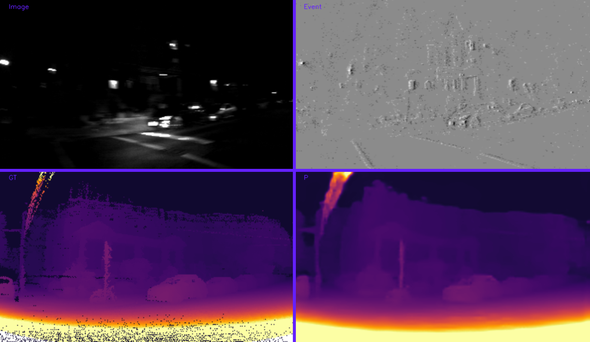

# Depth Estimation by Camera and LiDAR Fusion

This work proposes a Recurrent-CNN-based network for depth estimation using an event camera, a frame camera, and a LiDAR sensor, we evaluate our model on [The MVSEC Dataset](https://daniilidis-group.github.io/mvsec/)  and [The Event-Scape Dataset](https://rpg.ifi.uzh.ch/RAMNet.html) .

## Abstract

Depth estimation is one of the most important tasks in autonomous driving, and LiDAR sensors could accomplish this task accurately but their data is sparse. On the other hand, monocular methods for this task are not as accurate and robust as LiDAR sensors, therefore, combining LiDAR data with cameras could boost the robustness and precision of the task, and also solve the sparsity of LiDAR data. Three sensors are used in this work, two types of cameras (a frame camera and an event camera) and a LiDAR sensor, so this network uses three types of sensors as the input, and generates depth information on the output.

**videos from results:**

Day1 on The MVSEC Dataset

P: Our network prediction, GT: Ground Truth

Night1 on The MVSEC Dataset

P: Our network prediction, GT: Ground Truth

Night2 on The MVSEC Dataset

P: Our network prediction, GT: Ground Truth

Night3 on The MVSEC Dataset

P: Our network prediction, GT: Ground Truth

